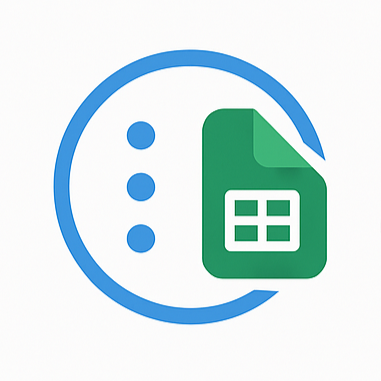

<!DOCTYPE html>
<html lang="en">
<head>
  <meta charset="UTF-8" />
  <meta name="viewport" content="width=device-width, initial-scale=1.0" />
  <meta name="description" content="Meta2Sheet - Transfer data from Metabase to Google Sheets in one click." />
  <link rel="icon" href="logo-raw.png" type="image/png">
</head>
<body>
  <h1 style="display: flex; align-items: center; gap: 12px;">
    
    Meta2Sheet
  </h1>
  
Allows users to transfer the data from Metabase to Google Sheets directly.

  

    
<strong>Say goodbye to manual downloads —</strong> sync your Metabase data to Google Sheets in one click.

  

  
Tired of the repetitive task of exporting data from Metabase and uploading it to Google Sheets? This extension simplifies your workflow by allowing you to transfer data directly from Metabase dashboards into a GSheet with just a single click.

  <h2>✨ Key Features</h2>
  <ul>
    <li>✅ Instant data transfer</li>
    <li>✅ No CSV downloads or uploads</li>
    <li>✅ Seamless integration with your Google account</li>
    <li>✅ Supports filtered and customized dashboard views</li>
  </ul>

  
Perfect for analysts, teams, and anyone who needs up-to-date insights in Google Sheets — effortlessly.

  <h2>🔐 Privacy</h2>
  
Meta2Sheet does not collect any personal data. All data stays on your browser or within authorized Google services. View our full <a href="privacy-policy.html">Privacy Policy</a>.

  <h2>📩 Contact</h2>
  
Fill in the <a href="https://airtable.com/app7xmIEMpOlki8rR/paghePwut1EMNrR6W/form">Feedback</a>.

  
Reach us at <a href="mailto:lunaticsainwork+meta2sheet@gmail.com">Support</a>.

  <h2>🚀 Chrome Web Store</h2>
  
Install Meta2Sheet from the <a href="https://chromewebstore.google.com/detail/jgobhalhcegkbhkcolndapamfengaefn">Chrome Web Store</a>.

</body>
</html>
